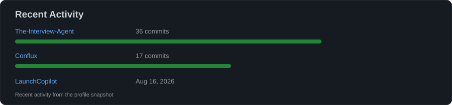

<div align="center">


</div>

---

## 🧑‍💻 About Me

I'm a Computer Science student focused on becoming a stronger software engineer by building real projects and improving my fundamentals.

- 🤖 Exploring **AI, LLMs & AI Agents**
- 🐍 Building with **Python**
- ⚡ Practicing **C++ & Data Structures**
- 🌐 Learning **Backend & Full-Stack Development**
- ☁️ Exploring **AWS, Cloud & DevOps**
- 🏗️ Interested in **Distributed Systems**
- 🌱 Interested in **Open Source**

---

## 🚀 What I'm Building

```text
AI & LLMs             ███████████████████░░   Learning & Building
Backend Engineering   ██████████████████░░░   Python / Django
Cloud & DevOps        ███████████████░░░░░░   AWS / Infrastructure
DSA & C++             █████████████████░░░░   Problem Solving
Open Source           ████████████░░░░░░░░░   Growing
```

---

## 🛠️ Tech Stack

<div align="center">


</div>

---

## 🚀 Featured Projects

<table>
<tr>
<td width="50%" valign="top">

<div align="center">

# ☁️ Syncra
### *One Drive. Your Cloud.*

</div>

**Syncra** is a cloud-drive application that gives users a simple interface for managing files while using their own AWS S3 storage.

**✨ Highlights**

- 🔐 Account authentication
- ☁️ Connect your own S3 storage
- 📤 Upload & download files
- 📁 Create and manage folders
- 🗑️ Delete files and folders
- 📊 Track storage usage
- 🔒 S3 credentials protected by the backend
- ❄️ Designed for S3 storage-class/lifecycle workflows

**🧰 Stack**

`Django` `Django REST Framework` `React` `PostgreSQL` `AWS S3`

<br>

<div align="center">

<a href="https://syncra-opal-nine.vercel.app/"></a>
<a href="https://github.com/c-sidd/Syncra"></a>

</div>

</td>
<td width="50%" valign="top">

<div align="center">

# ⛓️ Conflux
### *Converging Systems. Building Tomorrow.*

</div>

**Conflux** is a blockchain-focused project exploring decentralized applications, smart contracts, and secure data flows.

**✨ Highlights**

- ⛓️ Blockchain-based architecture
- 📜 Smart-contract driven workflows
- 🔐 Secure and transparent records
- 🧩 Web3 integration
- 🌐 Full-stack application flow
- 🏗️ Built as a practical blockchain learning project

**🧰 Stack**

`Solidity` `Hardhat` `Web3.js` `React` `Node.js`

<br>

<div align="center">

<a href="https://github.com/c-sidd/Conflux"></a>

</div>

</td>
</tr>
</table>

---

## 🔀 Pull Requests

<div align="center">

### Open Source Contributions

<a href="https://github.com/search?q=author%3Ac-sidd+is%3Apr&type=pullrequests">

</a>

<br><br>

<a href="https://github.com/search?q=author%3Ac-sidd+is%3Apr+is%3Aopen&type=pullrequests">

</a>

<a href="https://github.com/search?q=author%3Ac-sidd+is%3Apr+is%3Amerged&type=pullrequests">

</a>

</div>

> 💡 Click **View All My Pull Requests** to see PRs I've opened across GitHub, including contributions to other repositories.

---

## 📊 GitHub Analytics

<div align="center">

<a href="https://github.com/c-sidd">

</a>

</div>

---

## 🐍 Contribution Snake

<div align="center">


</div>

---

## 🏆 GitHub Highlights

<div align="center">



</div>

---

## 🌐 Connect With Me

<div align="center">

<a href="https://linkedin.com/in/Chandrachud"></a>
<a href="https://github.com/c-sidd"></a>
<a href="mailto:chandrachudsiddharth@gmail.com"></a>

</div>

---

<div align="center">

### 💭 *Learn. Build. Break. Fix. Repeat.*


</div>
