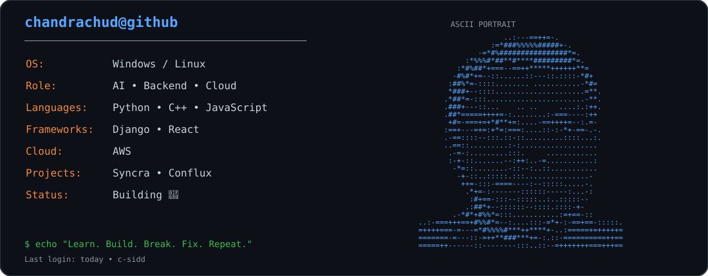
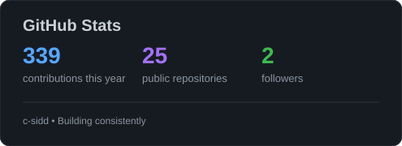
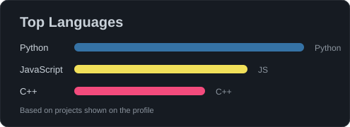
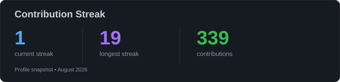

<div align="center">



</div>

---

## 🧑‍💻 About Me

I'm a Computer Science student focused on becoming a stronger software engineer by building real projects and improving my fundamentals.

- 🤖 Exploring **AI, LLMs & AI Agents**
- 🐍 Building with **Python**
- ⚡ Practicing **C++ & Data Structures**
- 🌐 Learning **Backend & Full-Stack Development**
- ☁️ Exploring **AWS, Cloud & DevOps**
- 🏗️ Interested in **Distributed Systems**
- 🌱 Interested in **Open Source**

---

## 🚀 What I'm Building

```text
AI & LLMs             ███████████████████░░   Learning & Building
Backend Engineering   ██████████████████░░░   Python / Django
Cloud & DevOps        ███████████████░░░░░░   AWS / Infrastructure
DSA & C++             █████████████████░░░░   Problem Solving
Open Source           ████████████░░░░░░░░░   Growing
```

---

## 🛠️ Tech Stack

<div align="center">


</div>

---

## 🔥 Featured Projects

<table>
<tr>
<td width="50%">

### 🔄 Syncra

A project focused on synchronization and building practical software systems.

<a href="https://syncra-opal-nine.vercel.app/">🚀 Live Demo →</a>  
<a href="https://github.com/c-sidd/Syncra">📂 Repository →</a>

</td>
<td width="50%">

### 🌐 Conflux

A project focused on connecting systems and building practical software solutions.

<a href="https://github.com/c-sidd/Conflux">📂 Repository →</a>

</td>
</tr>
</table>

---

## 📊 GitHub Analytics

<div align="center">




<br><br>



</div>

---

## 🐍 Contribution Snake

<div align="center">


</div>

---

## 🏆 GitHub Highlights

<div align="center">


</div>

---

## 🌐 Connect With Me

<div align="center">

<a href="https://linkedin.com/in/Chandrachud"></a>
<a href="https://github.com/c-sidd"></a>
<a href="mailto:chandrachudsiddharth@gmail.com"></a>

</div>

---

<div align="center">

### 💭 *Learn. Build. Break. Fix. Repeat.*


</div>
